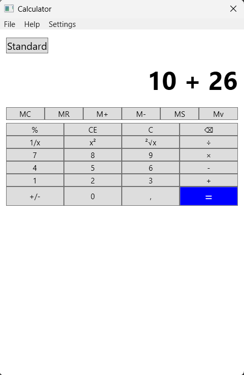
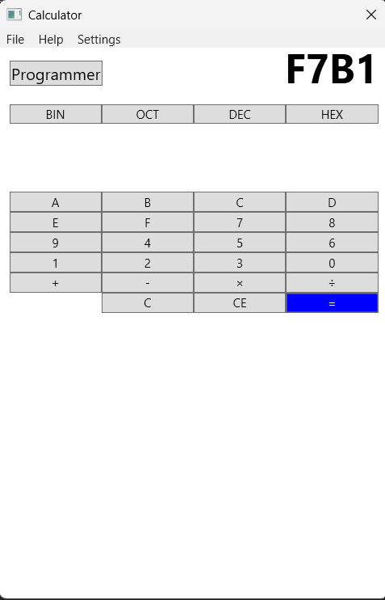

# WPF Calculator

It's a modern Windows desktop calculator built with C# and WPF. Supports both **Standard** and **Programmer** modes, memory operations, digit grouping, and persistent settings.

In **Standard Mode**, users can perform basic arithmetic operations such as addition, subtraction, multiplication, and division, as well as more advanced functions like square, square root, inverse, and sign toggling. The calculator also supports memory operations, allowing users to store, recall, and manage values for multi-step calculations.
**Programmer Mode** enables users to work with different numerical bases (binary, octal, decimal, hexadecimal), preparing the ground for future integration of bitwise operations and conversion tools. Input is automatically restricted to valid characters based on the selected base.
The application includes custom implementations for Cut, Copy, and Paste, keyboard input support, and a non-resizable WPF interface for consistency. All user preferences (digit grouping, calculator mode, and programmer base) are saved persistently in a settings file and automatically loaded on startup.

## Features

- standard arithmetic operations: +, -, ×, ÷, %(modulo)
- memory: MS, MR, M+, M-, MC
- scientific: x², √x, 1/x, ± toggle
- programmer mode (base 2, 8, 10, 16 support planned)
- digit grouping toggle with save to settings
- keyboard shortcuts for fast access
- context menu: Cut, Copy, Paste
- instant vs manual calculation toggle
- WPF interface with no resize option

## Technologies used

- C#: core programming language for application logic
- WPF (Windows Presentation Foundation): UI framework for building the desktop application's interface
- XAML: Used to design the layout and visual components of the calculator
- .NET Framework 4.7.2: Runtime platform for building and running the application
- CultureInfo: Ensures decimal separator consistency and regional formatting
- Visual Studio: IDE used for development and debugging

## Preview 

### Standard mode

### Programmer mode

